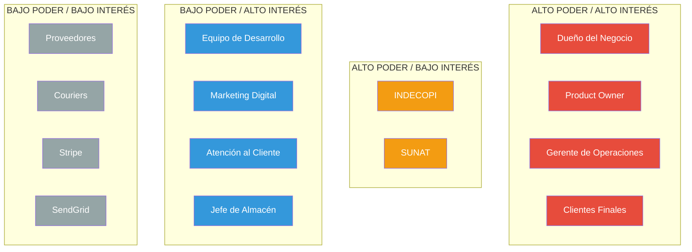

# Descripción del Proyecto

## Descripción General

El proyecto consiste en el desarrollo de una **plataforma de comercio electrónico especializada en la venta de componentes y equipos de cómputo**, dirigida al mercado peruano. La plataforma permitirá a los clientes explorar, comparar y adquirir productos tecnológicos de manera segura y eficiente, mientras proporciona a los administradores herramientas completas para gestionar inventario, pedidos y operaciones comerciales.

El sistema se desarrollará utilizando tecnologías modernas y robustas (**Rust + Axum** para el backend, **SvelteKit** para el frontend, y **PostgreSQL** como base de datos principal), garantizando alto rendimiento, seguridad y escalabilidad.

---

## Contexto y Justificación

### Problema Identificado:

El mercado peruano de componentes de PC presenta las siguientes características:
- **Fragmentación del mercado**: Múltiples vendedores con inventarios dispersos y poca información unificada.
- **Falta de confianza**: Los compradores desconfían de la calidad, garantías y precios de productos tecnológicos.
- **Experiencia de usuario deficiente**: Muchas tiendas en línea tienen interfaces obsoletas, procesos de compra complicados y falta de información técnica detallada.
- **Gestión manual ineficiente**: Los vendedores carecen de herramientas modernas para gestionar inventario, pedidos y reportes.
- **Limitaciones en métodos de pago**: Pocas opciones de pago seguras y locales.

### Oportunidad:

Desarrollar una plataforma moderna que:
- Centralice la información de productos con especificaciones técnicas detalladas.
- Ofrezca una experiencia de usuario fluida y confiable.
- Proporcione múltiples métodos de pago seguros (tarjetas, Yape, transferencias).
- Facilite la gestión operativa con un panel administrativo completo.
- Genere confianza mediante valoraciones verificadas y transparencia en precios.

---

## Objetivos del Proyecto

### Objetivo General:
Desarrollar una plataforma de e-commerce completa y funcional para la venta de componentes de PC que mejore la experiencia de compra de los clientes y optimice la gestión operativa del negocio.

### Objetivos Específicos:

**Para Clientes:**
1. Proporcionar un catálogo completo y organizado de productos con información técnica detallada.
2. Facilitar la búsqueda y comparación de productos mediante filtros avanzados.
3. Ofrecer un proceso de compra simple, rápido y seguro.
4. Permitir el seguimiento en tiempo real de pedidos y envíos.
5. Implementar un sistema de valoraciones y reseñas para generar confianza.

**Para Administradores:**
1. Desarrollar un panel de administración intuitivo para gestionar productos, inventario y categorías.
2. Automatizar el control de stock y generar alertas de reabastecimiento.
3. Proporcionar herramientas para gestionar pedidos y estados de envío.
4. Generar reportes analíticos sobre ventas, productos y clientes.
5. Implementar un sistema de auditoría para trazabilidad de operaciones.

**Técnicos:**
1. Garantizar un tiempo de respuesta menor a 200ms en el 95% de las peticiones.
2. Asegurar disponibilidad del sistema del 99.9% (SLA).
3. Implementar medidas de seguridad para proteger datos sensibles (PCI DSS compliance para pagos).
4. Desarrollar una arquitectura escalable que soporte crecimiento futuro.
5. Garantizar la integridad y consistencia de datos mediante transacciones ACID.

---

## Alcance Técnico

### **Tecnologías Confirmadas:**
- **Frontend:** SvelteKit 2.0 + TypeScript + TailwindCSS
- **Backend:** Rust 1.75+ + Axum 0.7
- **Base de Datos:** PostgreSQL 16
- **Cache:** Redis 7
- **Procesamiento de Pagos:** Stripe
- **Email:** SendGrid / SMTP
- **Storage:** S3 / MinIO
- **Reverse Proxy:** Nginx
- **Containerización:** Docker + Docker Compose
- **Monitoreo:** Prometheus + Grafana (básico)

---

## Alcance de Entregables

| **Entregable** | **Descripción** | **Formato** |
|----------------|-----------------|-------------|
| **Código Fuente** | Código completo del proyecto (frontend, backend, scripts) | Repositorio Git |
| **Base de Datos** | Scripts SQL de creación, migraciones y seeds | .sql |
| **Documentación Técnica** | Arquitectura, APIs, modelos de datos | Markdown + Diagramas |
| **Documentación de Usuario** | Manual de uso para administradores | PDF / Web |
| **Guía de Instalación** | Instrucciones de despliegue (desarrollo y producción) | Markdown |
| **Scripts de Despliegue** | Scripts automatizados para deploy | Shell / Docker Compose |
| **Tests** | Tests unitarios y de integración básicos | Código (Rust + JS) |
| **Configuraciones** | Archivos de configuración (Nginx, Docker, env) | Archivos de config |

---

## Stakeholders (Partes Interesadas)

### Stakeholders Internos

#### Equipo de Desarrollo

**Desarrollador Frontend/Backend 1 - Módulo Catálogo**
- **Rol:** Desarrollador Full-Stack
- **Responsabilidades:**
  - Desarrollo del módulo de catálogo completo (frontend + backend)
  - Implementación del sistema de búsqueda y filtros
  - Desarrollo del sistema de valoraciones
  - Gestión de productos e imágenes
- **Intereses:**
  - Código limpio y mantenible
  - Buenas prácticas de desarrollo
  - Documentación clara de APIs
- **Expectativas:**
  - Especificaciones funcionales claras
  - Acceso a recursos y herramientas necesarias
  - Retroalimentación oportuna

**Desarrollador Frontend/Backend 2 - Módulo Compras**
- **Rol:** Desarrollador Full-Stack
- **Responsabilidades:**
  - Desarrollo del módulo de compras (frontend + backend)
  - Implementación del carrito de compras
  - Integración con pasarelas de pago (Stripe)
  - Sistema de gestión de usuarios y autenticación
  - Gestión de pedidos y envíos
- **Intereses:**
  - Seguridad en transacciones
  - Correcta integración con APIs externas
  - UX fluida en proceso de checkout
- **Expectativas:**
  - Documentación de APIs de terceros
  - Ambientes de prueba (sandbox)
  - Testing exhaustivo de pagos

**Desarrollador Frontend/Backend 3 - Módulo Gestión**
- **Rol:** Desarrollador Full-Stack
- **Responsabilidades:**
  - Desarrollo del panel administrativo completo
  - Implementación del control de inventario
  - Sistema de reportes y analytics
  - Gestión de proveedores y órdenes de compra
  - Sistema de auditoría
- **Intereses:**
  - Herramientas de administración eficientes
  - Visualización clara de datos
  - Performance en consultas complejas
- **Expectativas:**
  - Requisitos claros de reportes
  - Acceso a datos de prueba realistas
  - Definición de métricas importantes

---

#### Gestión y Liderazgo

**Product Owner / Gerente de Proyecto**
- **Rol:** Responsable de la visión del producto y priorización
- **Responsabilidades:**
  - Definir y priorizar requerimientos
  - Validar entregables
  - Tomar decisiones sobre alcance
  - Comunicación con stakeholders
  - Gestión de tiempos y presupuesto
- **Intereses:**
  - Cumplimiento de plazos
  - Calidad del producto final
  - Satisfacción de usuarios finales
  - ROI positivo
- **Expectativas:**
  - Reportes de avance semanales
  - Entregables a tiempo
  - Transparencia en impedimentos
- **Métricas de Éxito:**
  - Completar MVP en 12 semanas
  - 0 bugs críticos en producción
  - Tiempo de carga < 2 segundos

**Dueño del Negocio / CEO**
- **Rol:** Tomador de decisiones estratégicas
- **Responsabilidades:**
  - Aprobar presupuesto
  - Definir visión del negocio
  - Aprobar inversiones en infraestructura
- **Intereses:**
  - Retorno de inversión
  - Crecimiento del negocio
  - Ventaja competitiva
  - Reducción de costos operativos
- **Expectativas:**
  - Aumento de ventas del 40% en primer año
  - Reducción de costos operativos del 60%
  - Plataforma escalable para crecimiento
- **Métricas de Éxito:**
  - Tasa de conversión > 3%
  - Ticket promedio > S/. 800
  - Retención de clientes > 30%

---

#### Operaciones

**Gerente de Operaciones / Logística**
- **Rol:** Responsable de cumplimiento de pedidos y envíos
- **Responsabilidades:**
  - Gestión de inventario físico
  - Coordinación de envíos
  - Gestión de proveedores
  - Control de calidad de productos
- **Intereses:**
  - Herramientas eficientes para gestión de pedidos
  - Visibilidad de inventario en tiempo real
  - Alertas de stock bajo
  - Trazabilidad de envíos
- **Expectativas:**
  - Panel administrativo intuitivo
  - Reportes de inventario precisos
  - Notificaciones automáticas de pedidos
- **Métricas de Éxito:**
  - 95% de pedidos despachados en 24 horas
  - 0 ventas sin stock disponible
  - Tiempo de preparación de pedido < 2 horas

**Jefe de Almacén**
- **Rol:** Gestión del almacén y control de stock
- **Responsabilidades:**
  - Recepción de mercadería
  - Picking y packing de pedidos
  - Actualización de stock
  - Control de ubicaciones físicas
- **Intereses:**
  - Sistema fácil de usar
  - Sincronización rápida de inventario
  - Alertas de productos mal ubicados
- **Expectativas:**
  - Interface simple para actualizar stock
  - Visualización clara de ubicaciones
  - Reportes de movimientos de inventario

---

#### Ventas y Marketing

**Gerente de Marketing Digital**
- **Rol:** Responsable de estrategias de marketing online
- **Responsabilidades:**
  - Campañas publicitarias
  - SEO y SEM
  - Gestión de promociones
  - Análisis de conversión
- **Intereses:**
  - Sistema de cupones flexible
  - Gestión de banners promocionales
  - Analytics de conversión
  - Integración con Google Analytics
- **Expectativas:**
  - Herramientas para crear promociones rápidamente
  - Reportes de efectividad de campañas
  - SEO-friendly URLs
- **Métricas de Éxito:**
  - CTR de banners > 5%
  - Tasa de uso de cupones > 15%
  - Posicionamiento orgánico Top 10 en Google

**Especialista en Atención al Cliente**
- **Rol:** Soporte post-venta
- **Responsabilidades:**
  - Atención a consultas de clientes
  - Gestión de reclamos
  - Seguimiento de devoluciones
- **Intereses:**
  - Acceso rápido a información de pedidos
  - Historial completo de clientes
  - Sistema de notificaciones eficiente
- **Expectativas:**
  - Panel para consultar pedidos rápidamente
  - Información detallada de clientes
  - Capacidad de modificar pedidos antes de envío

---

### Stakeholders Externos

#### Clientes Finales

**Cliente Regular (Gamer / Entusiasta)**
- **Perfil:**
  - Edad: 18-35 años
  - Conocimiento técnico: Medio-Alto
  - Frecuencia de compra: 2-4 veces al año
  - Ticket promedio: S/. 800 - S/. 2,500
- **Necesidades:**
  - Información técnica detallada de productos
  - Comparación de productos
  - Valoraciones de otros compradores
  - Proceso de compra rápido
  - Seguimiento de pedido en tiempo real
- **Expectativas:**
  - Precios competitivos
  - Stock actualizado en tiempo real
  - Envío rápido (24-48 horas en Lima)
  - Productos genuinos con garantía
  - Múltiples métodos de pago
- **Frustraciones:**
  - Información incompleta de productos
  - Stock desactualizado
  - Proceso de compra complicado
  - Falta de tracking de envío

**Cliente Corporativo (Empresas)**
- **Perfil:**
  - Compradores: IT Managers, Compradores corporativos
  - Frecuencia de compra: Mensual
  - Ticket promedio: S/. 5,000 - S/. 30,000
  - Requiere facturación
- **Necesidades:**
  - Compras al por mayor
  - Cotizaciones rápidas
  - Facturación electrónica
  - Crédito (30-60 días)
  - Productos especializados
- **Expectativas:**
  - Precios preferenciales por volumen
  - Atención personalizada
  - Garantías extendidas
  - Soporte técnico post-venta
- **Frustraciones:**
  - Proceso de compra diseñado solo para retail
  - Límites de cantidad por producto
  - Falta de contacto directo con ventas

---

#### Proveedores y Partners

**Distribuidores / Mayoristas**
- **Rol:** Proveedores de productos
- **Responsabilidades:**
  - Suministro de inventario
  - Garantías de productos
  - Soporte técnico de productos
- **Intereses:**
  - Volumen de compras consistente
  - Pago puntual
  - Visibilidad de sus productos
  - Reportes de ventas
- **Expectativas:**
  - Órdenes de compra claras
  - Comunicación fluida
  - Pago en términos acordados (30-60 días)
- **Interacción con el Sistema:**
  - Recepción de órdenes de compra por email
  - Consultas de stock (manual, no integrado)

**Empresas de Courier / Logística**
- **Rol:** Transporte y entrega de pedidos
- **Responsabilidades:**
  - Recolección de paquetes
  - Transporte seguro
  - Entrega al cliente final
  - Actualización de tracking
- **Intereses:**
  - Volumen de envíos constante
  - Paquetes bien etiquetados
  - Coordinación eficiente
- **Expectativas:**
  - Guías de envío correctas
  - Información completa del destinatario
  - Coordinación de recojo puntual
- **Interacción con el Sistema:**
  - Recepción de número de tracking (ingreso manual)
  - No hay integración API en Fase 1

**Stripe (Procesador de Pagos)**
- **Rol:** Proveedor de servicios de procesamiento de pagos
- **Responsabilidades:**
  - Procesamiento seguro de transacciones
  - Cumplimiento PCI DSS
  - Detección de fraude
  - Manejo de reembolsos
- **Intereses:**
  - Comisión por transacción (2.9% + $0.30)
  - Cumplimiento de regulaciones
  - Baja tasa de fraude
- **Expectativas:**
  - Integración correcta de API
  - Manejo adecuado de webhooks
  - Gestión responsable de tokens
- **Interacción con el Sistema:**
  - API REST para pagos
  - Webhooks para eventos de pago
  - Dashboard de Stripe para conciliación

**SendGrid (Servicio de Email)**
- **Rol:** Proveedor de servicio de email transaccional
- **Responsabilidades:**
  - Entrega confiable de emails
  - Templates de email
  - Reportes de deliverability
- **Intereses:**
  - Volumen de emails enviados
  - Buena reputación del dominio
  - Cumplimiento anti-spam
- **Expectativas:**
  - Uso correcto de API
  - Contenido de emails apropiado
  - Gestión de bounces y unsubscribes
- **Interacción con el Sistema:**
  - API REST para envío de emails
  - Templates personalizados

---

### Matriz de Poder e Interés de Stakeholders

**Estrategia por Cuadrante:**

| **Cuadrante** | **Estrategia** | **Stakeholders** |
|---------------|----------------|------------------|
| **Alto Poder / Alto Interés** | **Gestionar Cercanamente** - Comunicación frecuente, involucramiento en decisiones | Dueño del Negocio, Product Owner, Gerente de Operaciones, Clientes Finales |
| **Alto Poder / Bajo Interés** | **Mantener Satisfechos** - Informar de cambios importantes, cumplir regulaciones | INDECOPI, SUNAT |
| **Bajo Poder / Alto Interés** | **Mantener Informados** - Comunicación regular, feedback constante | Equipo de Desarrollo, Marketing, Atención al Cliente |
| **Bajo Poder / Bajo Interés** | **Monitorear** - Comunicación mínima necesaria | Proveedores, Couriers, APIs de terceros |

---